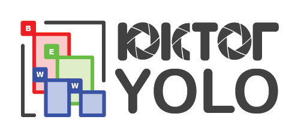
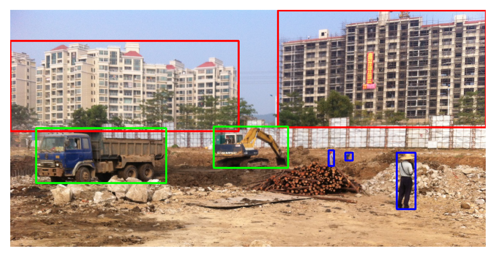

# **Construction Object Detection**



## **Table of Contents**
1. [Introduction](#introduction)
2. [Dataset](#dataset) ([download](https://o365coloradoedu-my.sharepoint.com/:f:/g/personal/ambe3060_colorado_edu/EsiLaSYkGdNHoFcBRx9agQUByGehkQTnz8BxAGVirKEmcg?e=h8dr5S))
3. [Methods](#methods)
4. [Results](#Results)
5. [Pre-trained models](#pre-trained-models) ([download](https://o365coloradoedu-my.sharepoint.com/:f:/g/personal/ambe3060_colorado_edu/EsW8i7TP5npEnh5unl8cSYcBNp8c9fiwzRxDzbfx0oL2LA?e=P0nBh3))
6. [Tutorials](#tutorials)

## **Introduction**

The repository presents real-time detection of construction-related objects (e.g.,building, equipment, worker). The detailed procedures can be found in the following paper.

### Article

[**Deep Convolutional Networks for Construction Object Detection Under Different Visual Conditions**](https://www.frontiersin.org/articles/10.3389/fbuil.2020.00097/full) \
Nipun D. Nath, Amir H. Behzadan\
Frontiers in Built Environment 6, pp. 97

Please cite the article if you use the dataset, model or method(s), or find the article useful in your research. Thank you!

### LaTeX citation:

```
@article{Nath2020,
    author  = {Nipun D. Nath and Amir H. Behzadan},
    title   = {Deep Convolutional Networks for Construction Object Detection Under Different Visual Conditions},
    journal = {Frontiers in Built Environment},
    volume  = {6},
    year    = {2020},
    pages   = {97}
```

## **Dataset**

### Dataset statisctics

The dataset (named **Pictor-v2**) contains 1,105 crowd-sourced and 1,402 web-mined images of buildings, equipment, and workers. Crowd-sourced and web-mined images contain 2,611 and 2,257 instances of workers, respectively. A brief statistics of the dataset is shown in the following figure.


### Annotation example

Please follow comments in the notebook [Annotation-Reading.ipynb](Annotation-Reading.ipynb) to understand the annotation format.

### Download the crowd-sourced dataset

The crowd-sourced images and annotated labels can be found in these folders:
- [Crowd-sourced images](https://o365coloradoedu-my.sharepoint.com/:f:/g/personal/ambe3060_colorado_edu/Es5wpQoxFRZIqT9MvR3Du28BaO8F1OB3yzgjRU-5E_xReA?e=T4tgLG).
- [Train, test, and validation labels](https://o365coloradoedu-my.sharepoint.com/:f:/g/personal/ambe3060_colorado_edu/EldWjZB4AmxCrQjLeANVu60BeGnP7FTfFS3A5iS3F-4Lfg?e=VPxm6R).

## **Methods**

The methodology presented in the paper is summarized in the following figure:


## **Results**

- The mean-average-precision (mAP) of YOLO-v2 models in detecting classes:


- The mean-average-precision (mAP) of YOLO-v3 models in detecting classes:


## **Pre-trained Models**

Models trained on different combinations of Pictor-v2 dataset are available in this [folder](https://o365coloradoedu-my.sharepoint.com/:f:/g/personal/ambe3060_colorado_edu/EsW8i7TP5npEnh5unl8cSYcBNp8c9fiwzRxDzbfx0oL2LA?e=SecKuE).

The folder contains following models:
- YOLO-v2 trained on crowd-sourced dataset.
- YOLO-v2 trained on web-mined dataset.
- YOLO-v2 trained on combined (crowd-sourced + web-mined) dataset.
- YOLO-v3 trained on crowd-sourced dataset.
- YOLO-v3 trained on web-mined dataset.
- YOLO-v3 trained on combined (crowd-sourced + web-mined) dataset (**BEST PERFORMING MODEL**).

## **Tutorials**

Please follow the notebooks in [tutorials](https://github.com/nipundebnath/pictor-ppe/blob/master/tutorials/) folder to learn more about:
- Building YOLO model from scratch using tensorflow 2.0.
- Interpret YOLO output and convert to bounding boxes with class label and confidence score.
